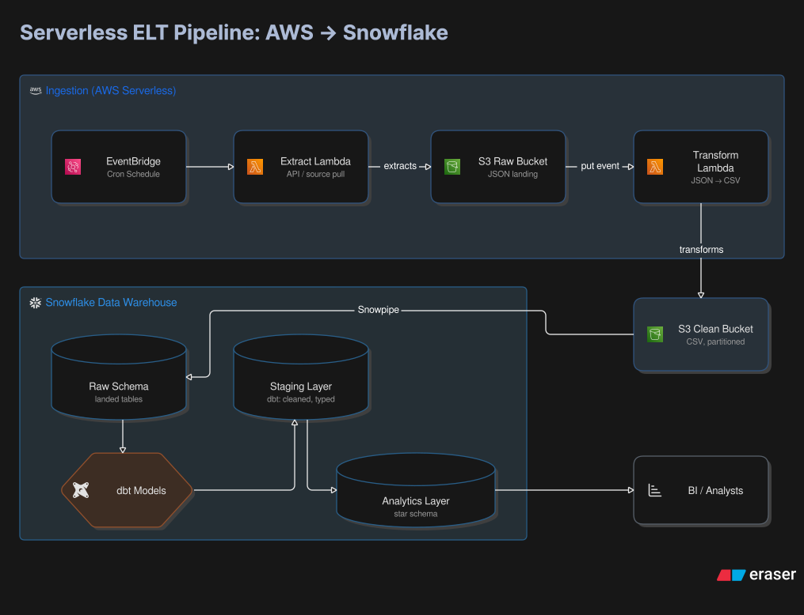

📈 End-to-End Serverless Financial Market Data ELT Pipeline

📌 Project Overview & Business Case
Financial analysts require clean, reliable, historical market data to perform quantitative trading analysis. However, managing continuous server infrastructure to ingest and process daily API feeds introduces unnecessary overhead and costs.
* The Goal: Build a fully automated, event-driven serverless ELT pipeline that extracts daily historical stock data from the Financial Modeling Prep (FMP) API (Free Tier Companies), transforms raw unstructured payloads via AWS Lambda, auto-ingests data using Snowpipe, and models a production-ready Star Schema with dbt Core.
* Key Achievements: Achieved a $0-infrastructure footprint using pay-per-execution AWS Lambda functions, decoupled storage layers using AWS S3, and established automated, near-real-time ingestion to Snowflake without scheduling traditional COPY INTO batches.

🛠️ Tech Stack & Skills Demonstrated
* Compute & Orchestration: AWS Lambda (Python 3.14 Runtimes), Amazon EventBridge
* Storage & Cloud Security: AWS S3 (Raw/Clean separation), AWS IAM (Least-Privilege Roles & Policies)
* Data Warehousing: Snowflake (Snowpipe, External Stages, Storage Integrations, File Formats)
* Data Transformation: dbt Core (Data Build Tool)

🏗️ System Architecture
The architecture leverages modern cloud-native, serverless design patterns, moving from unstructured API payloads to an optimized analytical data warehouse layer.

Serverless Data Lifecycle:
1. Scheduled Extraction: An Amazon EventBridge cron rule triggers the Extraction Lambda Function Tue-Sat, which requests the previous days historical stock prices from the FMP API and saves raw JSON payloads to a s3 bucket for raw data.
2. Event-Driven Transformation: An ObjectCreated event on the Raw S3 bucket automatically invokes the Transformation Lambda Function. This script extracts, flattens, dedups, applies type constraints, and writes optimized, clean CSV files into a s3 bucket for transformed data.
3. Automated Snowpipe Loading: Snowflake's Snowpipe listens to the transformed data S3 bucket using an SQS notification queue, auto-ingesting new CSV files directly into the Snowflake RAW schema tables the second they land.
4. Data Modeling & Analytics: dbt Core acts as the transformation engine within Snowflake, refining raw formats into modular staging layers before materializing a high-performance analytics star schema.

📊 Dimensional Data Model (Star Schema)
The final ANALYTICS layer inside Snowflake converts flat transactional rows into a star schema explicitly optimized for fast time-series analytical queries.

📐 Entity Relationship Layout:
* fct_daily_stock_prices (Fact Table): Tracks numerical, historical trading metrics like: open_price, close_price, high, low, volume.
* dim_company (Dimension Table): Stores descriptive company metadata like: ticker_symbol, company_name, sector, and industry.
* dim_date (Dimension Table): A comprehensive custom time-dimension table supporting easy aggregations using things like month_name and is_weekend, year. It also builds a time sequence for just open trading days.

⚡ Engineering Decisions & Trade-Offs
* Why Lambda Over AWS EC2 or Managed Airflow (MWAA)?
    Traditional compute instances incur continuous hourly charges even when idling. Because the daily FMP extraction and flattening tasks complete within seconds, AWS Lambda handles the entire compute workload for fractions of a cent, reducing operational infrastructure costs to virtually zero.
* Splitting Lambda into Separate Extract vs. Transform Functions:
    Decoupled functions follow the single-responsibility principle. The extraction function is bounded by API rate limits and network IO, while the transformation function is strictly bounded by CPU/Memory. Separating them prevents an API failure from halting or complicating the data transformation stage.
* Immutability via Raw vs. Clean S3 Storage Separation:
    The Raw S3 bucket acts as an unalterable historical log of API states. If business rules change, or downstream tables require a complete backfill, data engineers can replay the entire data history from raw JSON without incurring extra costs or hitting API daily volume caps.
* Chose not to do daily API calls for company profile information:
    Adding this would have put the project in danger of going over the Free API limits for FMP. Although I would have like to have added this to practice more SCD Type 2 functionality in the project decided it wasn't worth the cost. Practiced creating the infrastructure for this within dbt Core by building a snapshot, and applied it to the dim_company model.
